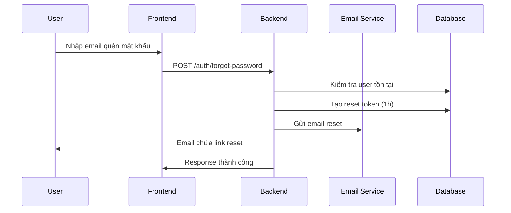
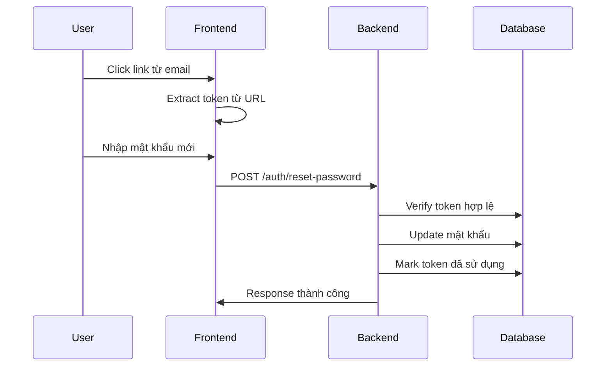

# 📧 HƯỚNG DẪN SỬ DỤNG TÍNH NĂNG QUÊN MẬT KHẨU

## 🎯 Tổng Quan

Tính năng quên mật khẩu cho phép người dùng reset mật khẩu thông qua email khi họ quên mật khẩu đăng nhập. Hệ thống sẽ gửi link reset password có thời hạn về email đã đăng ký.

## 🔧 Cấu Hình Email

### 1. Cấu Hình Environment Variables

Tạo file `.env` và thêm các biến môi trường sau:

```bash
# Cấu hình Email SMTP
SMTP_HOST="smtp.gmail.com"
SMTP_PORT=587
SMTP_USER="your-email@gmail.com"
SMTP_PASS="your-app-password"

# URL Frontend (để tạo link reset)
FRONTEND_URL="http://localhost:3000"
```

### 2. Cấu Hình Gmail App Password

Để sử dụng Gmail làm SMTP server:

1. **Bật 2-Factor Authentication:**
   - Vào [Google Account Settings](https://myaccount.google.com/security)
   - Bật "2-Step Verification"

2. **Tạo App Password:**
   - Vào "Security" > "App passwords"
   - Chọn "Mail" và tạo password
   - Sử dụng password này cho `SMTP_PASS`

### 3. Các SMTP Provider Khác

```bash
# Outlook/Hotmail
SMTP_HOST="smtp-mail.outlook.com"
SMTP_PORT=587

# Yahoo Mail
SMTP_HOST="smtp.mail.yahoo.com"
SMTP_PORT=587

# SendGrid
SMTP_HOST="smtp.sendgrid.net"
SMTP_PORT=587
```

## 🚀 Cách Sử Dụng API

### 1. Yêu Cầu Reset Mật Khẩu

```bash
POST /api/v1/auth/forgot-password
Content-Type: application/json

{
  "email": "user@example.com"
}
```

**Response:**

```json
{
  "message": "If an account with that email exists, a password reset link has been sent."
}
```

### 2. Reset Mật Khẩu Với Token

```bash
POST /api/v1/auth/reset-password
Content-Type: application/json

{
  "token": "reset-token-from-email",
  "newPassword": "NewPassword123!",
  "confirmPassword": "NewPassword123!"
}
```

**Response:**

```json
{
  "message": "Password reset successfully"
}
```

## 📝 Quy Trình Hoạt Động

### 1. Người Dùng Quên Mật Khẩu



### 2. Reset Mật Khẩu



## 🛡️ Bảo Mật

### 1. Token Security

- **Thời hạn:** Token hết hạn sau 1 giờ
- **Một lần sử dụng:** Token chỉ dùng được 1 lần
- **Random:** Sử dụng crypto.randomBytes(32)

### 2. Privacy Protection

- Không tiết lộ thông tin user có tồn tại hay không
- Response luôn trả về message tương tự

### 3. Database Schema

```sql
CREATE TABLE "password_resets" (
    "id" UUID PRIMARY KEY,
    "user_id" UUID NOT NULL,
    "token" TEXT UNIQUE NOT NULL,
    "expires_at" TIMESTAMP NOT NULL,
    "used" BOOLEAN DEFAULT false,
    "created_at" TIMESTAMP DEFAULT NOW()
);
```

## 📧 Email Templates

### 1. Password Reset Email

- **Subject:** "Reset Your Password - SEO CMS"
- **Template:** Professional HTML với CTA button
- **Nội dung:** Hướng dẫn reset, cảnh báo bảo mật

### 2. Email Verification (Bonus)

- **Subject:** "Verify Your Email - SEO CMS"
- **Template:** Welcome message với verification link

### 3. Welcome Email (Bonus)

- **Subject:** "Welcome to SEO CMS Platform!"
- **Template:** Giới thiệu tính năng, quick start guide

## 🧪 Test API

### 1. Test Script PowerShell

```powershell
# Test forgot password
$forgotData = @{
    email = "test@example.com"
} | ConvertTo-Json

$response = Invoke-RestMethod -Uri "http://localhost:3001/api/v1/auth/forgot-password" `
    -Method POST -Body $forgotData -ContentType "application/json"

Write-Host $response.message
```

### 2. Test với cURL

```bash
# Forgot password
curl -X POST http://localhost:3001/api/v1/auth/forgot-password \
  -H "Content-Type: application/json" \
  -d '{"email":"test@example.com"}'

# Reset password
curl -X POST http://localhost:3001/api/v1/auth/reset-password \
  -H "Content-Type: application/json" \
  -d '{"token":"your-token","newPassword":"NewPass123!","confirmPassword":"NewPass123!"}'
```

## 🔍 Troubleshooting

### 1. Email Không Gửi Được

**Kiểm tra logs:**

```bash
npm run start:dev
# Xem console logs cho email errors
```

**Các lỗi thường gặp:**

- ❌ SMTP credentials sai
- ❌ App password chưa được tạo
- ❌ 2FA chưa được bật
- ❌ Firewall block port 587

### 2. Token Errors

**Invalid token:**

- Token đã hết hạn (>1h)
- Token đã được sử dụng
- Token không tồn tại

**Fix:**

- Yêu cầu reset mới
- Kiểm tra database `password_resets` table

### 3. Development Mode

Nếu chưa có SMTP, email service sẽ log warning và không gửi email:

```
SMTP not configured. Password reset email not sent.
```

## 📊 Monitoring

### 1. Database Queries

```sql
-- Xem các reset request
SELECT * FROM password_resets
ORDER BY created_at DESC
LIMIT 10;

-- Reset tokens chưa sử dụng
SELECT * FROM password_resets
WHERE used = false AND expires_at > NOW();
```

### 2. Logs Quan Trọng

- ✅ "Password reset email sent to {email}"
- ✅ "SMTP server is ready to take our messages"
- ❌ "SMTP connection failed"
- ❌ "Failed to send password reset email"

## 🎨 Frontend Integration

### 1. Forgot Password Form

```typescript
const handleForgotPassword = async (email: string) => {
  const response = await fetch('/api/v1/auth/forgot-password', {
    method: 'POST',
    headers: { 'Content-Type': 'application/json' },
    body: JSON.stringify({ email }),
  });

  const data = await response.json();
  alert(data.message);
};
```

### 2. Reset Password Form

```typescript
const handleResetPassword = async (
  token: string,
  newPassword: string,
  confirmPassword: string,
) => {
  const response = await fetch('/api/v1/auth/reset-password', {
    method: 'POST',
    headers: { 'Content-Type': 'application/json' },
    body: JSON.stringify({ token, newPassword, confirmPassword }),
  });

  if (response.ok) {
    alert('Password reset successfully!');
    // Redirect to login
  }
};
```

## 🔄 Tính Năng Bổ Sung

Hệ thống cũng hỗ trợ:

1. **Email Verification** - Xác thực email khi đăng ký
2. **Welcome Email** - Email chào mừng user mới
3. **Resend Verification** - Gửi lại email xác thực

## 📈 Next Steps

1. **Rate Limiting:** Giới hạn số lần request reset
2. **Email Templates:** Customize theo brand
3. **SMS OTP:** Thêm phương thức reset qua SMS
4. **Admin Panel:** Quản lý email templates

---

**✨ Chúc bạn sử dụng thành công!**

Nếu gặp vấn đề, hãy kiểm tra logs và đảm bảo cấu hình SMTP đúng.
